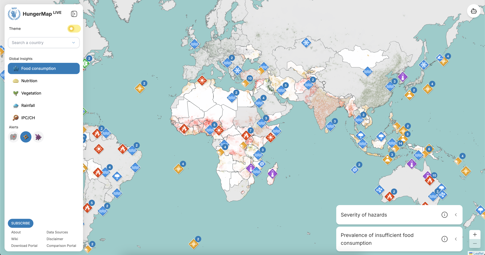
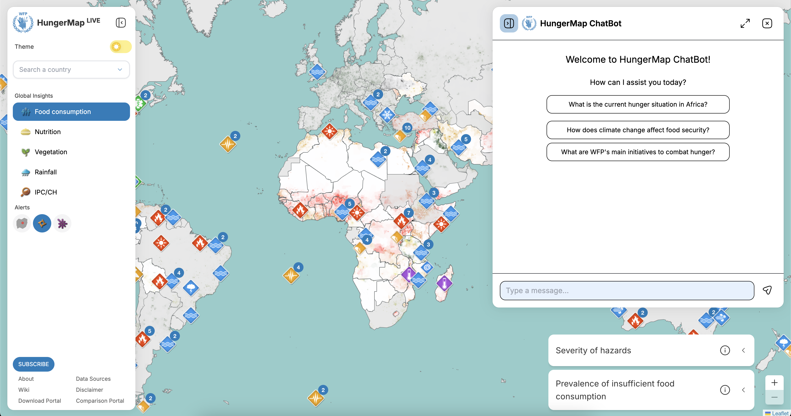
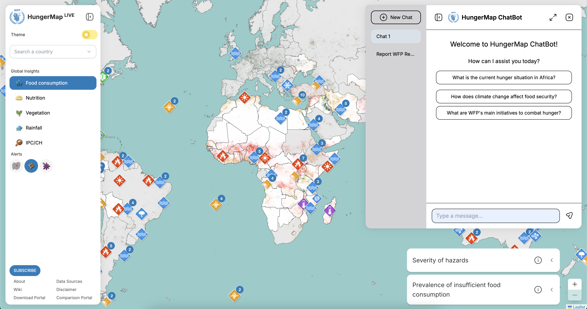
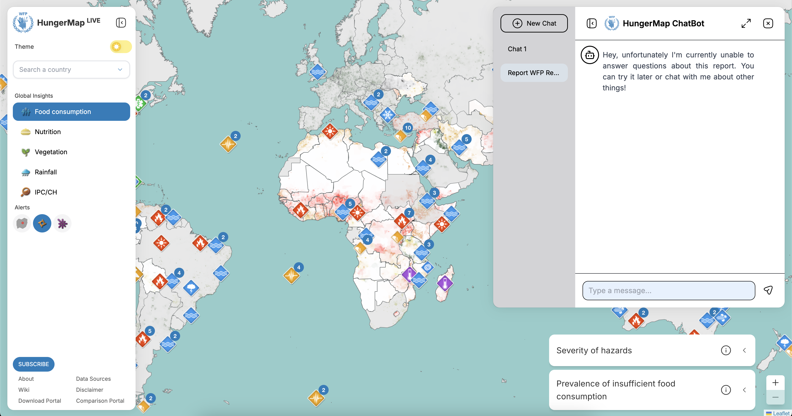
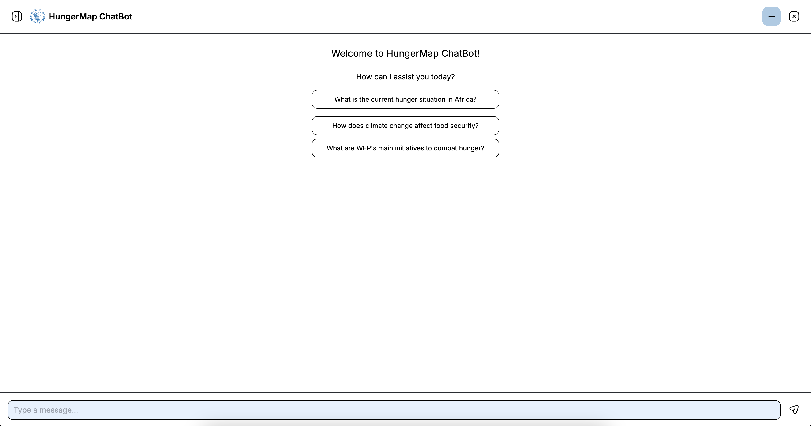
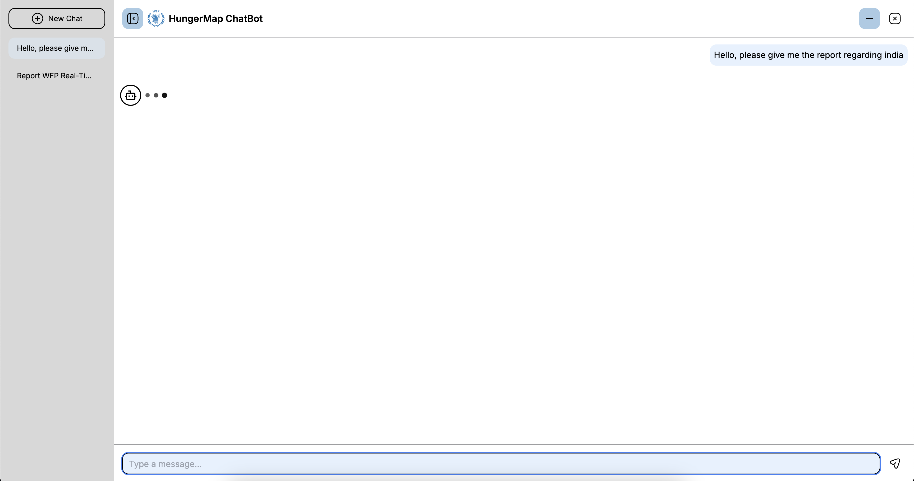
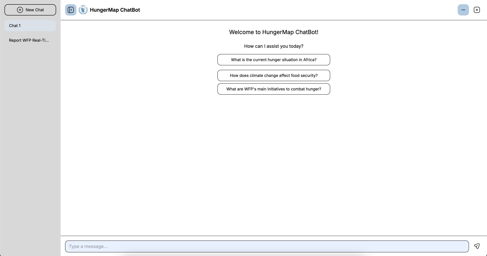

## Highlights
### Trigger the Chatbot from HungerMap Website
You can initiate the HungerMap Chatbot directly from the HungerMap website by clicking on the chatbot icon located in the upper right corner of the page. This seamless integration allows you to start interacting with the chatbot without leaving the page, providing a smooth user experience. The chatbot icon is easily identifiable with a speech bubble symbol, ensuring quick access.

*In the image above, the chatbot icon is highlighted in the upper right corner. Click on this icon to open the chatbot interface.*

### Default Prompts After Triggering the Chatbot
Upon triggering the chatbot, you will be greeted with three predefined default prompts. These prompts are thoughtfully designed to help you get started quickly by offering common queries that users typically ask. This feature ensures that you can immediately begin your interaction without having to think of a question from scratch. The prompts are displayed prominently at the bottom of the chatbot window.

*In the image above, the default prompts are shown at the bottom of the chatbot window. Click on any of these prompts to start your interaction with the chatbot.*

### Accessing the Chatbot Sidebar to Add a New Chat
The chatbot sidebar can be accessed to add a new chat session. This feature is particularly useful for managing multiple conversations simultaneously. Whether you need to ask different questions or handle various topics, the sidebar allows you to switch between chats effortlessly, ensuring a streamlined and organized interaction. To access the sidebar, click on the menu icon located on the left side of the chatbot window.

*In the image above, the sidebar menu icon is highlighted on the left side of the chatbot window. Click on this icon to open the sidebar and manage your chat sessions.*

### Viewing Chat History and Handling Errors
The chatbot interface includes a dedicated section for viewing the history of your chats. This allows you to easily refer back to previous conversations and maintain continuity in your interactions. Additionally, the chatbot is equipped with robust error handling capabilities. If any issues arise, user-friendly error messages will be displayed to help you understand and resolve the problem quickly. The chat history can be accessed by clicking on the history icon located at the top of the chatbot window.

*In the image above, the chat history icon is highlighted at the top of the chatbot window. Click on this icon to view your chat history. If an error occurs, a message similar to the one shown in the image will be displayed.*

### Full Screen Mode
For a more immersive experience, the chatbot can be expanded to full screen mode. This feature is especially beneficial when you need to focus on detailed information or engage in an extended conversation. Full screen mode provides a distraction-free environment, enhancing your interaction with the chatbot. To enter full screen mode, click on the full screen icon located in the upper right corner of the chatbot window.

*In the image above, the full screen icon is highlighted in the upper right corner of the chatbot window. Click on this icon to expand the chatbot to full screen mode.*

### Waiting for a Response from the Chatbot
While waiting for a response from the chatbot, you will see an indication that the chatbot is processing your query. This visual feedback reassures you that your request is being handled and helps manage your expectations regarding response times. The processing indicator is displayed prominently in the chat window.

*In the image above, the processing indicator is shown in the chat window. This indicator lets you know that the chatbot is working on your query.*

### Sidebar in Full Screen Mode
Even in full screen mode, the sidebar remains accessible. This allows you to manage your chats and access additional features without leaving the full screen view. The sidebar's persistent availability ensures that you can multitask and navigate through different chat sessions seamlessly. To access the sidebar in full screen mode, click on the sidebar icon located on the left side of the full screen chatbot window.

*In the image above, the sidebar icon is highlighted on the left side of the full screen chatbot window. Click on this icon to open the sidebar while in full screen mode.*

## Limitations
While the HungerMap Chatbot offers a range of useful features, there are some limitations that users should be aware of:

### Inability to Rename Chats
Currently, the HungerMap Chatbot does not support the ability to rename individual chat sessions. This means that all chat sessions are identified by default names or contents, which can make it challenging to quickly identify specific conversations, especially if you have multiple ongoing chats. This limitation can impact the user experience by making it harder to organize and manage chat histories effectively.

### Inability to Delete Chats
Another limitation is the inability to delete individual chat sessions. Once a chat is created, it remains in the chat history indefinitely. This can lead to cluttered chat histories, making it difficult to find relevant information or manage ongoing conversations. Users may find this particularly inconvenient if they want to remove outdated or irrelevant chats from their history.

### Inability to Stop Chatbot Responses
The HungerMap Chatbot currently does not provide an option to stop or cancel a response once it has been initiated. If the chatbot takes too long to generate a response, users are left waiting without the ability to interrupt the process. During this time, users can only wait or navigate to other parts of the website. This limitation can be frustrating, especially when timely information is needed.

### Summary
These limitations highlight areas where the HungerMap Chatbot could be improved to enhance user experience. The ability to rename and delete chats, as well as the option to stop or cancel responses, would provide users with greater control over their chat sessions, allowing for better organization and management of conversations. Despite these limitations, the chatbot remains a valuable tool for accessing information related to hunger and food security.

We are continuously working on improving the HungerMap Chatbot and appreciate any feedback from our users. Your suggestions help us prioritize new features and enhancements to better meet your needs.
