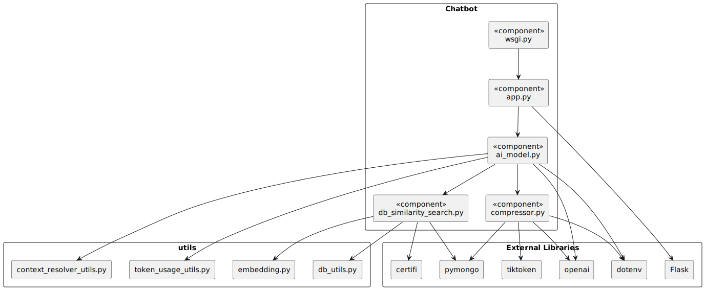
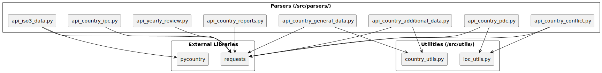
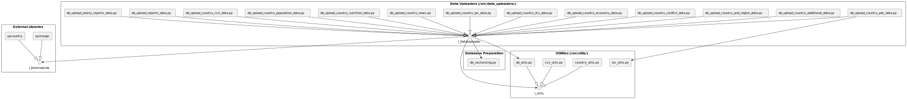
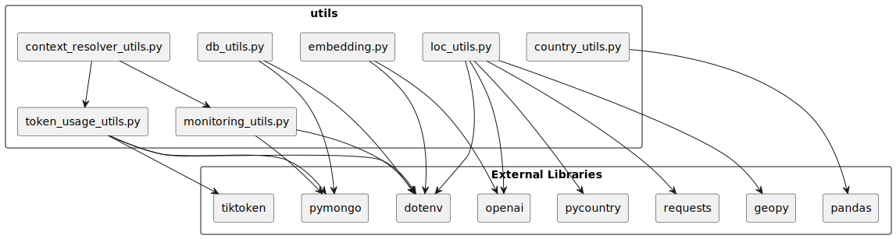

# Overview of Dependencies

Author: `Muhammed Emre Bayraktaroglu`

The **Chatbot** of the revamped HungerMapLive has several dependencies that are essential for its functionality. These dependencies include various data retrieval scripts, utility modules, and data uploaders, but also external libraries and APIs. This document provides an overview of the dependencies required to run the Chatbot successfully and how several modules are interconnected.

## Chatbot Overview

The Chatbot is one of the core components of the HungerMapLive project, providing users with a conversational interface to access information about food security, conflict events, and disaster reports. The Chatbot interacts with a MongoDB database to retrieve and display relevant data to users.
Following external dependencies are essential and required to run the Chatbot:
| Dependency | Description |
|------------|-------------|
| `Flask` | A lightweight WSGI web application framework for Python |
| `dotenv` | A Python module that reads key-value pairs from a `.env` file and adds them to the environment variables |
| `pymongo` | A Python driver for MongoDB that enables interaction with MongoDB databases |
| `openai` | A Python client for the OpenAI API, used for natural language processing tasks |
| `tiktoken` | A fast python BPE tokenizer for OpenAI's GPT models |
| `certifi` | A Python package that provides Mozilla's CA Bundle - used for the MongoDB connection |

### Data Parsing and Uploading Scripts 
The **Chatbot** relies on data provided from the MongoDB database, which is populated by various data parsing and uploading scripts. These scripts fetch data World Food Programme APIs and store it in the database for the Chatbot to access.  

:::note
You can enlarge pictures by clicking on them.
:::

| Utilities | Description |
|-----------|-------------|
| `country_utils.py` | Provides utility functions for converting country codes into readable country names|
| `loc_utils.py` | Contains utility functions for geolocation and locating places though coordinates|
| `db_utils.py` | Contains utility functions for interacting with the MongoDB database|
| `csv_utils.py` | Contains utility functions for reading and writing CSV files|
| `db_vectorizing.py` | Contains utility functions for vectorizing MongoDB documents for `Vector Search`|

### Utilities 
Common utility modules are used across the Chatbot project to streamline various tasks. These utilities include functions for database interaction, data processing, and file handling.

Dependencies for the Chatbot utilities additionally include:
| Utility | Description |
|---------|-------------|
| `requests` | A Python library for making HTTP requests |
| `pandas` | A data manipulation library for Python - using for CSVs|
| `pycountry` | A Python library providing ISO country codes and names |
| `geopy` | A Python client for several popular geocoding web services - particularly useful for geolocation tasks |