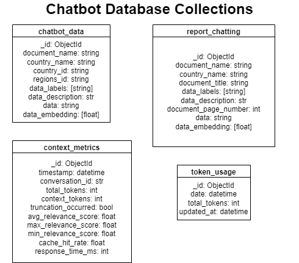

# Database Structure

Author: `Georgi Peev`

The WFP Chatbot utilizes MongoDB as its primary database system. The database architecture is designed to support efficient data retrieval, conversation context management, and usage monitoring.

---

## Schema Diagram



---

## Collections Overview

### 1. chatbot_data
Primary collection for storing general chatbot data:
```json
{
    "_id": "ObjectId",
    "document_name": "string",        // Unique identifier for the document
    "country_name": "string",         // Country the data belongs to
    "country_id": "string",           // Country ID code
    "regions_id": "string",           // Region ID code
    "data_labels": ["string"],        // Categories/tags for the data
    "data_description": "string",     // Description of the content
    "data": "string",                // Actual content text
    "data_embedding": [float]        // Vector embedding for similarity search
}
```

### 2. report_chatting
Collection for storing country-specific report data:
```json
{
    "_id": "ObjectId",
    "document_name": "string",        // Unique identifier for the document
    "country_name": "string",         // Country the report belongs to
    "document_title": "string",       // Title of the report
    "data_labels": ["string"],        // Categories/tags for the data
    "data_description": "string",     // Description of the content
    "document_page_number": "int", // Page number in source document
    "data": "string",                // Actual report content
    "data_embedding": [float]        // Vector embedding for similarity search
}
```

### 3. context_metrics
Collection for monitoring conversation context performance:
```json
{
    "_id": "ObjectId",
    "timestamp": "datetime",         // When metrics were recorded
    "conversation_id": "string",     // Unique conversation identifier
    "total_tokens": "number",        // Total tokens in conversation
    "context_tokens": "number",      // Tokens used for context
    "truncation_occurred": "boolean",// Whether context was truncated
    "avg_relevance_score": "number", // Average relevance of retrieved docs
    "max_relevance_score": "number", // Maximum relevance score
    "min_relevance_score": "number", // Minimum relevance score
    "cache_hit_rate": "number",      // Rate of cache hits
    "response_time_ms": "number"     // Response time in milliseconds
}
```

### 4. token_usage
Collection for tracking daily token usage:
```json
{
    "_id": "ObjectId",
    "date": "datetime",             // Date of usage (midnight timestamp)
    "total_tokens": "number",       // Total tokens used that day
    "updated_at": "datetime"        // Last update timestamp
}
```

---

## Key Features

### 1. Vector Search
- Both `chatbot_data` and `report_chatting` include vector embeddings
- Enables semantic similarity search for relevant context
- Optimized for fast retrieval of related content

### 2. Performance Monitoring
- Comprehensive metrics tracking in `context_metrics`
- Token usage monitoring in `token_usage`
- Response time measurements
- Cache hit rate tracking

### 3. Data Organization
- Separation of general chatbot data and report-specific data
- Structured document metadata
- Vector embeddings for search optimization

---

## Configuration

The database connection is configured through environment variables:
```env
MONGODB_URI=mongodb://connection_string
MONGODB_DB=database_name
MONGODB_COLLECTION=collection_name
DAILY_TOKEN_LIMIT=26000
```

---

## Data Management

### 1. Data Ingestion
- Automated parsing of PDF reports into `report_chatting`
- Vector embedding generation for both collections
- Structured data organization

### 2. Monitoring & Cleanup
- Daily token usage tracking
- Context metrics collection
- Automated cleanup of old metrics (configurable retention)

### 3. Performance Optimization
- Vector indexing for similarity search
- Structured metadata for efficient querying
- Separate collections to optimize access patterns
