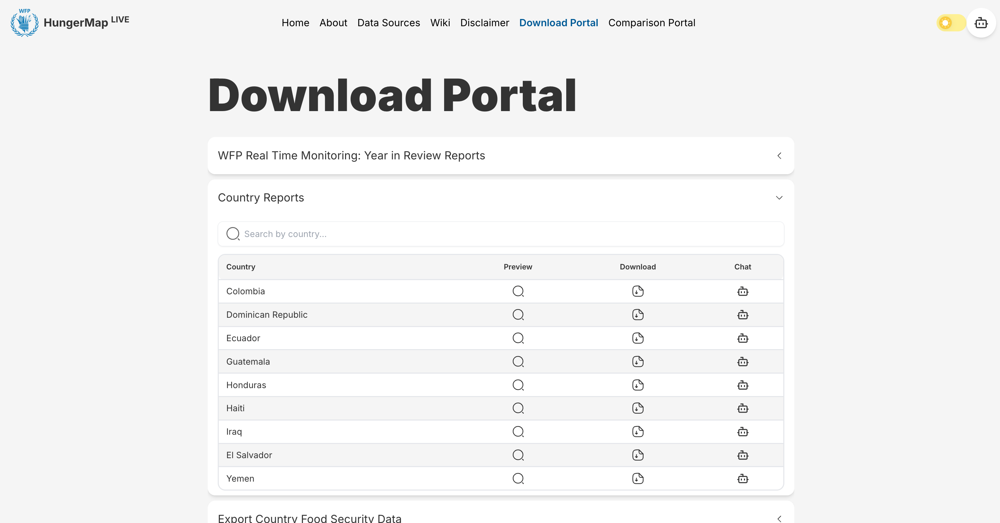

# Report Chatting Overview

Author: `Ahmet Selman Güclü`

## Introduction

The Report Chatting feature is an AI-powered functionality that allows users to interact with and query specific country reports directly through a chat interface. This feature is accessible through the Download Portal, where users can find country-specific reports and engage with their content through a dedicated chat button.

## What is Report Chatting?

Report Chatting enables users to:

- Ask questions about specific country reports.
- Get AI-generated responses based solely on the report's content.
- Access insights and information from reports in a conversational manner.
- Receive accurate, context-aware answers about the report's data.

## How to Access

The feature can be accessed through the Download Portal in two steps:

1. Navigate to the **"Country Reports"** section in the Download Portal.
2. Click the chat button (💬) next to any country's report to start a conversation.

The chat interface will open with a greeting message specifically mentioning the selected country, indicating that the conversation will be focused on that country's report.

## Technical Overview

The Report Chatting system is built on a sophisticated architecture that combines several key components. Here's a high-level overview of how the system works:

### How It Works

The system operates through two main workflows:

1. **Query Processing Flow** (Left Side)

   - Users interact with the chat interface in the frontend
   - Their questions are sent to the backend server via API requests
   - The AI model processes these questions and searches the database for relevant information
   - Using the retrieved context, the AI generates accurate responses
   - These responses are sent back to the user through the frontend interface
2. **Data Processing Flow** (Right Side)

   - PDF reports are processed through a specialized pipeline
   - The pipeline extracts, structures, and organizes the report data
   - This processed information is stored in the MongoDB database
   - The database serves as a knowledge base for the AI model to reference when answering questions

## What's Next

In the following documentation sections, we'll dive deeper into:

- The integration between frontend and backend components
- How report data is processed and structured
- The detailed mechanics of the report chatting functionality
