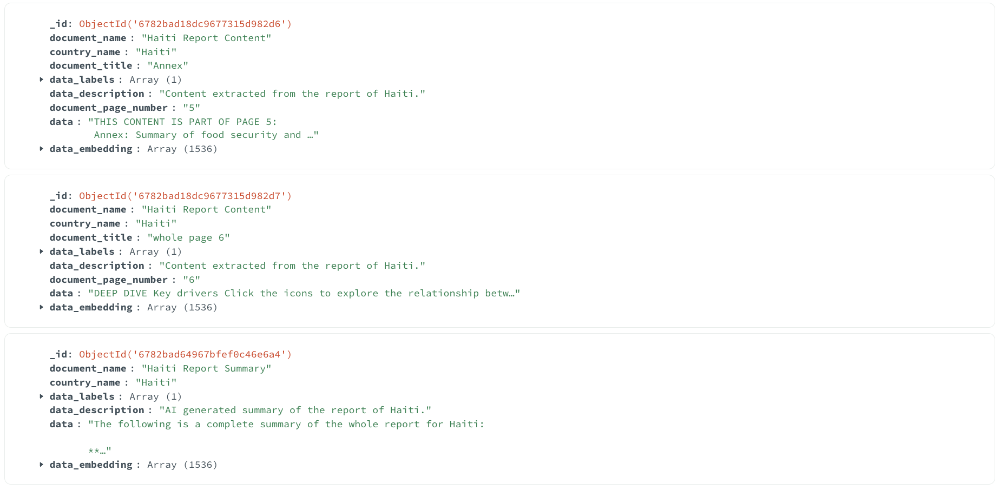

# Report Data Processing and Storage

Author: `Ahmet Selman Güclü`

## Overview

The report data processing system transforms PDF reports into structured data stored in MongoDB. Each report is processed in two ways:

1. The complete report content is split into meaningful sections
2. An AI-generated summary is created for the entire report

All report data is stored as text in the database.

## Report Configuration

Reports are configured in `reports_utils.py`, which maintains:

1. A list of available country reports with their URLs and country names as well as predefined report sections that are common across all countryreports:

```python
COUNTRY_REPORTS = [
    {
        "url": "https://static.hungermapdata.org/insight-reports/latest/hti-summary.pdf",
        "country_name": "Haiti",
    },
    # ... other reports
]

REPORT_CHUNKS = [
    "FOOD INSECURITY AT A GLANCE",
    "Current food security outlook",
    "Regions with the highest prevalence of insufficient food consumption",
    # ... other sections
]
```

2. A list of Year in Review reports with their URLs and corresponding years:

```python
YEAR_IN_REVIEW_REPORTS = [
    {
        "url": "https://static.hungermapdata.org/year-in-review/2023/Global.pdf",
        "year": 2023,
    },
    # ... other reports
]
```

## Processing Steps

The system uses two different parsers depending on the report type:

#### Year-in-Review Reports (`year_in_review_parser.py`)

1. Downloads the PDF from the year-specific URL
2. Identifies sections based on font size (headings)
3. Processes content page by page, maintaining heading context
4. Saves the processed content in both CSV and JSON formats

#### Country Reports (`report_chatting_data_parser.py`)

1. Downloads the PDF from the provided URL
2. Attempts to split the content into predefined chunks based on common sections
3. Falls back to page-by-page splitting if chunk detection fails
4. Saves the processed content in both CSV and JSON formats

```python
def parse_pdf(country_name: str, url: str):
    """
    Parse the pdf file from the url and write the structured data to CSV and JSON files.
    """
    # Create directory for report content data
    report_data_dir = os.path.join(SRC, "assets", "report_content_data")
    os.makedirs(report_data_dir, exist_ok=True)

    # Process PDF content
    pdf_document = fitz.open("pdf", pdf_content)
    for page_number in range(len(pdf_document)):
        page = pdf_document[page_number]
        page_text = page.get_text()
  
        # Try to find standard sections
        for title in TITLES:
            if title in page_text:
                # Extract and save section content
                content = extract_section(page_text, title)
                save_to_files(content)
```

This chunking approach significantly reduces token usage (for GPT-4o) compared to processing whole reports:

<pre class="font-styrene border-border-100/50 overflow-x-scroll whitespace-nowrap rounded border-[0.5px] shadow-[0_2px_12px_rgba(0,0,0,0.05)]"><table class="bg-bg-100 min-w-full border-separate border-spacing-0 text-sm leading-[1.88888]"><thead class="border-b-border-100/50 border-b-[0.5px] text-left"><tr class="[tbody>&]:odd:bg-bg-500/10"><th class="text-text-000 [&:not(:first-child)]:-x-[hsla(var(--border-100) / 0.5)] font-400 px-2 [&:not(:first-child)]:border-l-[0.5px]">Process</th><th class="text-text-000 [&:not(:first-child)]:-x-[hsla(var(--border-100) / 0.5)] font-400 px-2 [&:not(:first-child)]:border-l-[0.5px]">Token Usage</th><th class="text-text-000 [&:not(:first-child)]:-x-[hsla(var(--border-100) / 0.5)] font-400 px-2 [&:not(:first-child)]:border-l-[0.5px]">Reduction</th></tr></thead><tbody><tr class="[tbody>&]:odd:bg-bg-500/10"><td class="border-t-border-100/50 [&:not(:first-child)]:-x-[hsla(var(--border-100) / 0.5)] border-t-[0.5px] px-2 [&:not(:first-child)]:border-l-[0.5px]">Whole Report</td><td class="border-t-border-100/50 [&:not(:first-child)]:-x-[hsla(var(--border-100) / 0.5)] border-t-[0.5px] px-2 [&:not(:first-child)]:border-l-[0.5px]">2,800-5,400</td><td class="border-t-border-100/50 [&:not(:first-child)]:-x-[hsla(var(--border-100) / 0.5)] border-t-[0.5px] px-2 [&:not(:first-child)]:border-l-[0.5px]">-</td></tr><tr class="[tbody>&]:odd:bg-bg-500/10"><td class="border-t-border-100/50 [&:not(:first-child)]:-x-[hsla(var(--border-100) / 0.5)] border-t-[0.5px] px-2 [&:not(:first-child)]:border-l-[0.5px]">Chunked</td><td class="border-t-border-100/50 [&:not(:first-child)]:-x-[hsla(var(--border-100) / 0.5)] border-t-[0.5px] px-2 [&:not(:first-child)]:border-l-[0.5px]">90-540</td><td class="border-t-border-100/50 [&:not(:first-child)]:-x-[hsla(var(--border-100) / 0.5)] border-t-[0.5px] px-2 [&:not(:first-child)]:border-l-[0.5px]">Up to 93%</td></tr></tbody></table></pre>

### 2. AI Summary Generation

The `report_summarizer.py` creates comprehensive summaries of reports to enable better responses to high-level questions and overview requests. While chunked data is excellent for specific queries, summaries are crucial for:

- Answering general questions about the report
- Providing complete report overviews
- Maintaining context when users ask for summaries
- Offering holistic insights that might be lost in chunked data

```python
def create_summary(country_name: str, report_content: str, regenerate: bool = False) -> Dict:
    """
    Generates a summary of the report using OpenAI API and saves it as CSV and JSON.
    """
    # Generate summary using OpenAI
    system_prompt = """You are a professional analyst skilled in creating concise yet comprehensive
                report summaries."""

    user_prompt_template = f"""Please create a comprehensive summary of the following
        {'Year in Review report for' if report_type == 'year_in_review' else 'report about'} {identifier}.
        Focus on the key findings, statistics, and important trends.
        The summary should be well-structured and maintain the most critical information from the report.\n\n
        Report Content:\n"""

    messages = [
        {"role": "system", "content": system_prompt},
        {"role": "user", "content": user_prompt_template + report_content},
    ]

    response = openai.chat.completions.create(
        model=MODEL,
        messages=messages,
        temperature=0.7,
    )
  
    # Prepare summary data with explicit summary identifier
    title_prefix = "Year in Review" if report_type == "year_in_review" else "Report"
    summary_data = {
        "title": f"{identifier} {title_prefix} Summary",
        "summary": f"The following is a complete summary of the {title_prefix.lower()} for {identifier}:\n\n"
        + response.choices[0].message.content.strip(),
    }
  
    # Save as CSV and JSON files
    save_to_files(summary_data, country_name)
  
    return summary_data
```

### Content Identifiers

Since user prompts are of a semantic manner, no conventional pre-filtering can be done on the reports data, for example to only use entries for a specific page.

Consider a prompt like this: `Can you explain the diagram on page 4?`

To be able to still handle such queries, both summary and chunked content include specific identifiers which are added at the very beginning of their contents:

1. **For Summaries**:

   ```text
   "The following is a complete summary of the whole report for {country_name} / {year}:"
   ```
2. **For Country Report Chunks**:

   ```text
   "THIS CONTENT IS PART OF PAGE {page_number}:"
   ```
3. **For Year-in-Review Chunks**:

   ```text
   "THIS CONTENT IS FROM PAGE {page_number} AND CONTAINS THE CONTENT FOR THE FOLLOWING HEADINGS: {headings}"
   ```
4. **For Whole Pages (not-chunked)**

   ```plaintext
   "(this content is the whole page {page_number})"
   ```

These identifiers are crucial for the similarity search functionality, allowing it to:

- Match general queries with summary content
- Find page-specific information when requested
- Distinguish between different types of content (summary vs. chunked)
- Provide more accurate and contextual responses

### 3. Database Upload

The system uses specialized upload scripts for each type of content:

1. `db_upload_report_chatting_data.py` for country reports
2. `db_upload_year_in_review_report_data.py` for year-in-review reports
3. `db_upload_report_summary.py` for both types of summaries

Each script processes data into a consistent structure with type-specific fields:

#### For Country Reports
```python
{
"document_name": f"{country_name} Report Content",
"country_name": country_name,
"document_title": title,
"data_labels": ["reports_data"],
"data_description": f"Content extracted from the report of {country_name}.",
"document_page_number": page_number,
"data": content,
}
```

#### For Year-in-Review Reports
```python
{
"document_name": f"{year} Year in Review Report Content",
"year": year,
"document_title": title,
"data_labels": ["year_in_review_data"],
"data_description": f"Content extracted from the {year} Year in Review Report.",
"document_page_number": page_number,
"data": content,
}
```

#### For Summaries
```python
{
"document_name": f"{country_name} Report Summary",
"country_name": country_name,
"data_labels": ["reports_summary"],
"data_description": f"AI generated summary of the report of {country_name}.",
"data": data.get("summary"),
}
```

### 4. Batch Processing

The `upload_all_reports.py` script orchestrates the entire process. This means that for uploading or updating the data in the database it is enough to only run this script rather than going all the previous steps individually.

The script:

- Processes all configured reports in `reports_utils.py` sequentially
- Handles both content and summary uploads to the `report_chatting` collection
- Creates vector embeddings for similarity search

```python
def run_reports_upload():
    content_module = folder_path.replace("/", ".") + ".db_upload_report_chatting_data"
    summary_module = folder_path.replace("/", ".") + ".db_upload_report_summary"
    year_in_review_module = (
        folder_path.replace("/", ".") + ".db_upload_year_in_review_report_data"
    )

    for report in country_reports:
        country_name = report["country_name"]
        # Upload report content
        subprocess.run([python_executable, "-m", content_module, country_name])
        # Upload report summary
        subprocess.run([python_executable, "-m", summary_module, country_name])
        # ... existing code
    
    for report in year_in_review_reports:
        # ... upload report content
        # ... upload report summary
```

By default, the script will not re-generate a new AI generated summary for a report if one exists already. However, if it is wished to do so the following part can be modified with an additional flag in `run_reports_upload`:

```python
        summary_upload_result = subprocess.run(
            [python_executable, "-m", summary_module, country_name, true], # add a true flag here
            capture_output=True,
            text=True,
        )
```

This approach ensures that no unnecessary costs occur for generating AI summaries when they already exist

## Database Structure

All in all, the MongoDB `report_chatting` collection will contain three types of entries:

- **Multiple** Chunks per Country Report document. For example `Current food security outlook` for `Haiti Report Content`
- **Multiple** Chunks per Year-in-Review report document. For example `Januar-February` for `2023 Year in Review Report`
- **One** AI generated summary per document.

Here's a look into some entries of the database:



This structured approach ensures:

- Effective similarity search through vector embeddings
- Easy maintenance and updates of report data
- Clear separation between report content and summaries
- Effective data retrieval during chat interactions with low token costs and high quality results
