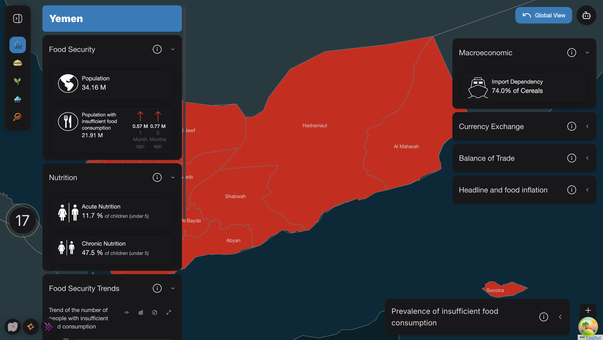
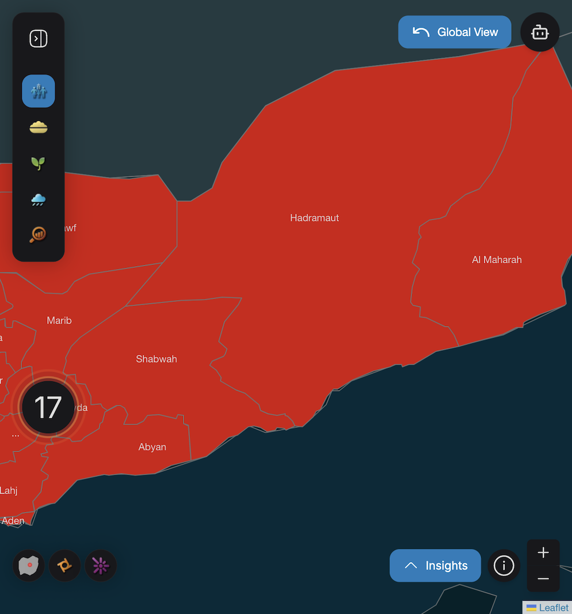
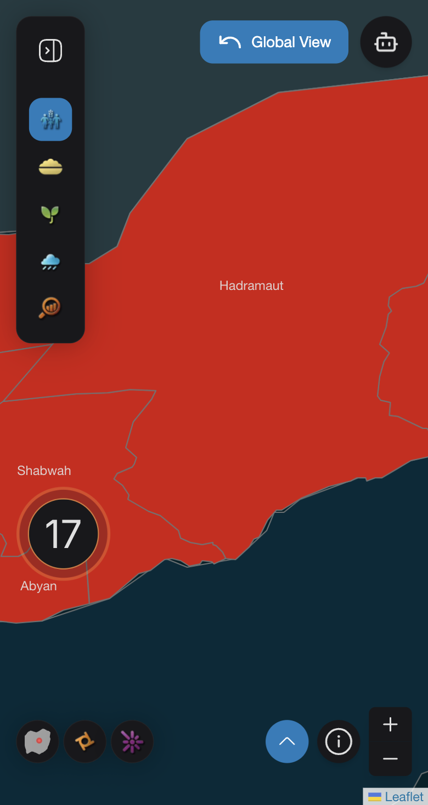
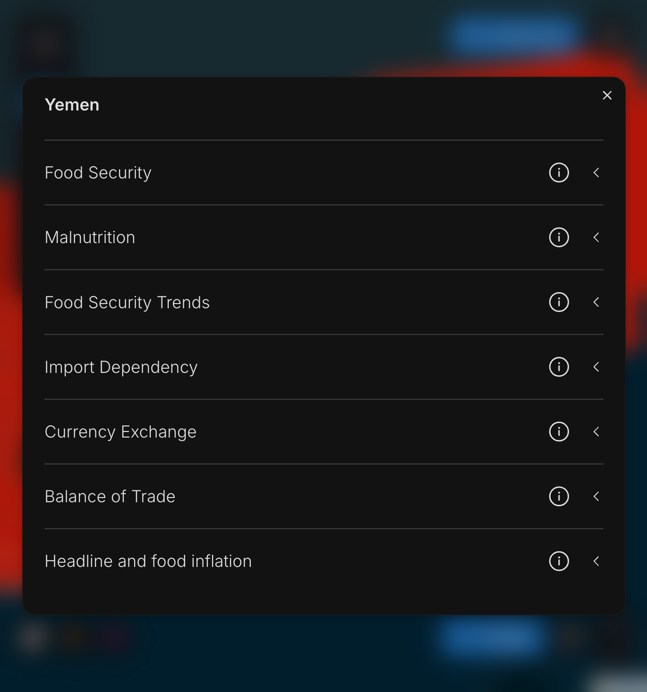
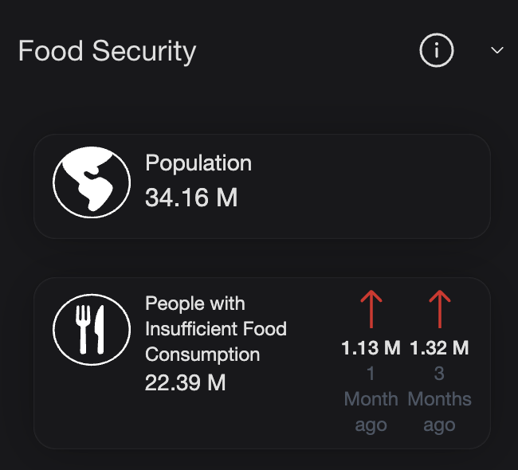

# Accordions

**Author:** `Armanpreet Ghotra`

The accordions in our application, sourced from NextUI, are designed to expand and reveal additional information or collapse to hide it. In this website, the accordions of the ***Splitted variant*** have been used. These accordions have been customized to align with our specific requirements. They are utilized in the following sections of the website:

- Comparison Portal
- Data Sources
- Country view of three types of map `FCS`, `Nutrition` and `IPC`.
- About
- Download Portal


#### Desktop Version
For example, in the FCS country view, the accordions are arranged as shown in the image below, with three on the left and four on the right. However, this arrangement is not consistent across all sections. In most other sections, the accordions are stacked vertically.




#### Mobile Version
Depend upon the dimension of the mobile either there will be button with an upward arrow or button with an upward arrow labeled as "Insights" displayed.







Regardless of the platform (desktop or mobile), each accordion includes an informational popover at the end for additional information.

---

#### Implementation
In `AccordionModal.tsx`, AccordionModal function is designed to render a model with dynamic content on different sizes of mobile screens. Depends upon the screen size of the mobile, if we have small screens **450px or less**, a circular button with an arrow up icon is displayed, while for slightly larger screens **700px or less** a button with an arrow up icon and label named ***Insights*** is shown. Clicking the button opens a modal containing content provided by the `useAccordionModal()` context. The modal includes a title and body fetched from this context and it allows scrolling inside if the content overflows and provides blurred background, enhancing the focus on the modal content. The modal's visibility is managed by the `useDisclosure()` hook.

`AccordionListItems.tsx` defines AccordionListItems function, which is used to render a list of accordion items, primarily designed for the mobile screens. It enables multiple selection modes, disable selection, expand all items or highlight specific words in the titles. Each accordion item can include tooltips, popovers, descriptions etc. When only one item is provided, it expands by default, otherwise items remain collapsed unless interacted with. The component integrates spinners for loading states and uses a highlighter library to emphasize specific words in item titles. It relies on utility functions, such as `AccordionOperations.getSelectionModeType`, to determine the selection behavior. The parameters of `AccordionListItems()` are defined as following :
```js
export default function AccordionListItems({
  items,
  loading = false,
  multipleSelectionMode = false,
  noSelectionMode = false,
  expandAll = false,
  highlightedTitleWords = [],
}: AccordionContainerProps)
```

whereas items are of type AccordionItemProps[] which represents the whole content of the accordions and it is defined as following:
```js
export interface AccordionItemProps {
  title: string;
  infoIcon?: ReactNode;
  tooltipInfo?: string;
  popoverInfo?: ReactNode;
  description?: ReactNode;
  content?: string | ReactElement;
  hideIndicator?: boolean;
  containedWords?: string;
}

export interface SearchableAccordionItemProps extends AccordionItemProps {
  containedWords: string;
}
```

The AccordionBoxItems function in `AccordionBoxItems.tsx` renders a set of collapsible accordion items stacked vertically for desktop version, with customization options for appearance, behavior and content. It allows single or multiple items to be expanded at once, supports word highlighting in titles and includes optional tooltips, popovers and loading spinners. The expandAll prop can automatically expand all items and a ReadMore Component manages lengthy popover content. The parameters of `AccordionBoxItems()` are defined as following:

```js
export default function AccordionBoxItems({
  items,
  title,
  loading = false,
  multipleSelectionMode = false,
  noSelectionMode = false,
  color = 'bg-content1',
  maxWidth,
  expandAll = false,
  highlightedTitleWords = [],
}: AccordionContainerProps)
```


`AccordionContainer.tsx` responsible for displaying accordion items adaptively for both mobile and desktop screens. For mobile, it uses a modal (triggered by a custom bottom button) to show the items, leveraging the `useAccordionModal` hook to manage modal content and title. For desktop version, it directly renders the accordions by packing them inside `<AccordionBoxItems>` and for mobile version accordions are packed inside `<AccordionListItems>`. Basically, using AccordionContainer function to call accordions.

```js
export default function AccordionContainer({
  items,
  title,
  loading = false,
  multipleSelectionMode = false,
  noSelectionMode = false,
  color = 'bg-content1',
  accordionModalActive,
  maxWidth,
  expandAll = false,
  highlightedTitleWords = [],
}: AccordionContainerProps)
```
---

**Accordion Content**

The content of the accordions can be a string or a ReactElement. For instance, in our use case, map layers like FCS and IPC use either a Card (which is a NextUI component) or charts (for example, a line chart) as content.

In ```Card.tsx```, the CustomCard function is structured to accept a title and content as props, with the content being an array of CardContent[]. We have two scenarios for how the cards are structured:

- First scenario: The SVG image is displayed on the left side of the card, followed by the card's title on the right, with numerical values appearing below the title. This scenario is depicted in the image below, and the card is named as ***Population***.

- Second scenario: Used to represent changes in food consumption trends, the design includes two additional SVG images on the left. The two SVGs are placed adjacent to each other, and below these SVG images, the numerical value is displayed. Beneath that, a small text indicates the age of the data, such as "1 month ago" or "3 months ago". This card is shown in the image below, and it is named as ***Population with Insufficient Food Consumption***.

The parameters of the card are as follows:

```js
export interface CardContent {
  imageSrc?: string;
  svgIcon?: React.ReactNode;
  text?: React.ReactNode;
  value?: string | number;
  content?: React.ReactNode;
  timeText?: string;
  altText?: string;
  changeValues?: {
    imageSrc: string;
    text: string;
    timeText: string;
    altText: string;
  }[];
  textClass?: string;
}

```




---

#### Example

In this case, the accordion content is a card. The accordions are first wrapped inside the ```<AccordionContainer>```. Within the AccordionContainer function, the wrapping depends on the device version: for mobile, the accordions are wrapped inside ```<AccordionListItems>```, while for desktop, they are wrapped inside ```<AccordionBoxItems>```.

```js

<AccordionContainer
    loading={loading}
    title={countryName}
    accordionModalActive
    maxWidth={600}
    items={[...foodSecurityAccordionItems, ...macroEconomicAccordionItems]}
/>
```

In this example the accordion content is a card, the items parameter of the AccordionContainer is set with:
- title: title of the Accordion
- infoIcon: SVG image of the info icon.
- popoverInfo: Fetched using FcsAccordionOperations.getFoodSecutriyPopoverInfo()
- content: Conditionally renders a CustomCard if nutritionData.Acute or nutritionData.Chronic is available.

```js
        title: 'Nutrition',
        infoIcon: <CustomInfoCircle />,
        popoverInfo: FcsAccordionOperations.getFoodSecutriyPopoverInfo(),
        content:
          nutritionData && (nutritionData.Acute != null || nutritionData.Chronic != null) ? (
            {nutritionData.Acute != null && (
              <CustomCard
                title="Acute Nutrition"
                content={[
                 {
                  svgIcon: <Nutrition className="w-[50px] h-[50px] object-contain" />,
                    text: (
                      <NutritionAccordionText
                        nutritionValue={`${nutritionData.Acute} %`}
                        text="of children (under 5)"
                      />
                      ),
                    },
                  ]}
                />
              )}
          )
```
The same thing happens if the content is a chart. We just need to call it the same way as a Card, but instead of `<CustomCard>`, we use the name of the chart, for example, `<LineChart>`.


