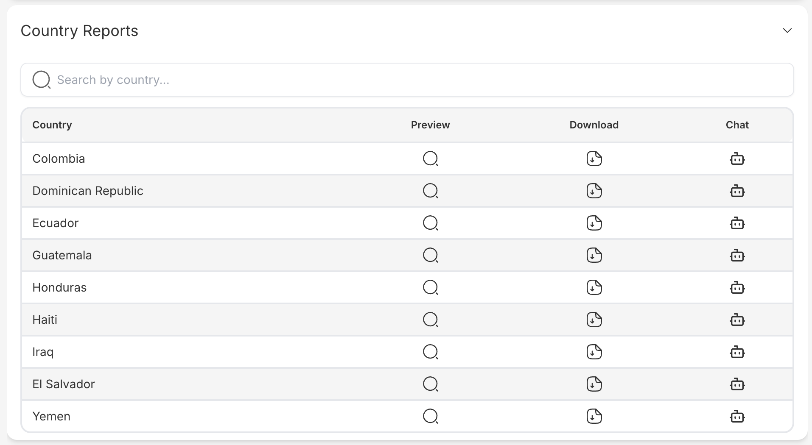
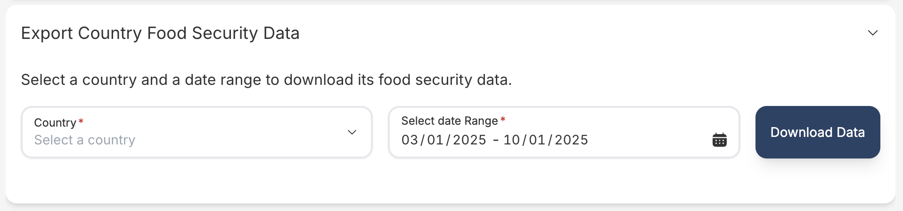

# Download page

**Author:** `Haidong Xu`

## Key features

This document provides an overview of the Download Page in the frontend of the WFP HungerMap project. The Download Page allows users to access and download various data and reports.

### Navigation Bar
- **Description**: The navigation bar provides links to different sections of the application, allowing users to easily navigate through the site. It includes links to the Home page, Country Data, FCS Data, Main Download Page, and Yearly Reports. The navigation bar is designed to be intuitive and accessible, ensuring that users can quickly find the information they need.


### Main Download Page
- **Description**: The main download page aggregates all available data and reports. Users can browse through different categories such as country reports, regional analyses, and thematic studies. Each category contains downloadable files in various formats (e.g., PDF, Excel). The main download page is designed to be a one-stop-shop for all data and reports, making it easy for users to find and download the information they need.


### Country Data
- **Description**: This section displays data specific to different countries. Users can select a country from a dropdown menu or a map interface to have preview of detailed information and download relevant data. The data includes various indicators such as food security levels, economic conditions, and demographic information. Besides users can also trigger here a chatbot directly to utlize our AI tool to help him use our website smoothly. This section is essential for users who need country-specific insights and data for analysis or reporting purposes.



### Food Consumption Score (FCS) Data
- **Description**: The FCS data section provides information on the Food Consumption Score, which is a key indicator used to assess food security. Users can download FCS data for various regions, which includes metrics on dietary diversity and food frequency. This data is crucial for understanding the nutritional status of populations and making informed decisions on food security interventions.



### Yearly Report
- **Description**: This section offers access to yearly reports. Users can download comprehensive reports that provide insights and analysis on food security trends over the past years. The reports include detailed assessments, statistical analyses, and recommendations for policy and program interventions. This section is valuable for researchers, policymakers, and practitioners who need historical data and trend analysis to inform their work.


## Technicality

The `Download Portal` page is designed to provide users with various reports and data downloads. It utilizes an accordion interface to organize the content into different sections. Each section is represented by a React component that displays specific types of data. The components used are:

  - `YearInReviewReports`
  - `CountryReports`
  - `DownloadCountryAccordion`

### Components Overview

1. **YearInReviewReports**: Displays reports for a specific year.
2. **CountryReports**: Displays reports for different countries.
3. **DownloadCountryAccordion**: Provides an accordion interface for downloading country-specific data.

### Example Usage

#### YearInReviewReports Component

The `YearInReviewReports` component is used to display reports for a specific year.
**Props**:
  - `yearInReviewReports`: An array of objects containing `label` and `url` for each report.

**Example:**
```tsx
import YearInReviewReports from './components/YearInReviewReports';

const yearInReviews: YearInReview[] = [
  { label: '2022 Report', url: 'https://example.com/2022-report' },
  { label: '2021 Report', url: 'https://example.com/2021-report' },
];

<YearInReviewReports yearInReviewReports={yearInReviews} />
```

#### CountryReports Component

The `CountryReports` component is used to display reports for different countries.

**Props**:
  - `countryCodesData`: An array of objects containing `country` information and `url` for each report.

**Example:**
```tsx
import CountryReports from './components/CountryReports';

// this is only an example data, in real you should according to DDD implement Repository to communicate with backend
const countryCodesData: CountryCodesData[] = [
  {
    country: { id: 1, name: 'United States', iso3: 'USA', iso2: 'US' },
    url: { summary: 'https://example.com/us-report' },
  },
  {
    country: { id: 2, name: 'Canada', iso3: 'CAN', iso2: 'CA' },
    url: { summary: 'https://example.com/ca-report' },
  },
];

<CountryReports countryCodesData={countryCodesData} />
```

#### DownloadCountryAccordion Component

The `DownloadCountryAccordion` component is used to display a list of countries in an accordion format, allowing users to download data for each country.

**Props**:
  - `countries`: An array of objects containing `id`, `name`, `iso3`, and `iso2` for each country.

**Example:**
```tsx
import DownloadCountryAccordion from './components/DownloadCountryAccordion';

// this is only an example data, in real you should according to DDD implement Repository to communicate with backend

const countries: ICountry[] = [
  { id: 1, name: 'United States', iso3: 'USA', iso2: 'US' },
  { id: 2, name: 'Canada', iso3: 'CAN', iso2: 'CA' },
];


<DownloadCountryAccordion countries={countries} />
```

Here is how you can integrate these components into a page using an accordion container:

```tsx
import React from 'react';
import AccordionContainer from './components/AccordionContainer';
import YearInReviewReports from './components/YearInReviewReports';
import CountryReports from './components/CountryReports';
import DownloadCountryAccordion from './components/DownloadCountryAccordion';

const yearInReviews: YearInReview[] = [
  { label: '2022 Report', url: 'https://example.com/2022-report' },
  { label: '2021 Report', url: 'https://example.com/2021-report' },
];

const countryCodesData: CountryCodesData[] = [
  {
    country: { id: 1, name: 'United States', iso3: 'USA', iso2: 'US' },
    url: { summary: 'https://example.com/us-report' },
  },
  {
    country: { id: 2, name: 'Canada', iso3: 'CAN', iso2: 'CA' },
    url: { summary: 'https://example.com/ca-report' },
  },
];

const countries: ICountry[] = [
  { id: 1, name: 'United States', iso3: 'USA', iso2: 'US' },
  { id: 2, name: 'Canada', iso3: 'CAN', iso2: 'CA' },
];

const DownloadPortalPage = () => {
  return (
    <div>
      <h1>Download Portal</h1>
      <div>
        <AccordionContainer
          multipleSelectionMode
          items={[
            {
              title: 'Year In Review Reports',
              content: <YearInReviewReports yearInReviewReports={yearInReviews} />,
            },
            {
              title: 'Country Reports',
              content: <CountryReports countryCodesData={countryCodesData} />,
            },
            {
              title: 'Export Country Data',
              content: <DownloadCountryAccordion countries={countries} />,
            },
          ]}
        />
      </div>
    </div>
  );
};

export default DownloadPortalPage;
```

This example demonstrates how to use the `YearInReviewReports`, `CountryReports`, and `DownloadCountryAccordion` components within an accordion container on a download portal page.