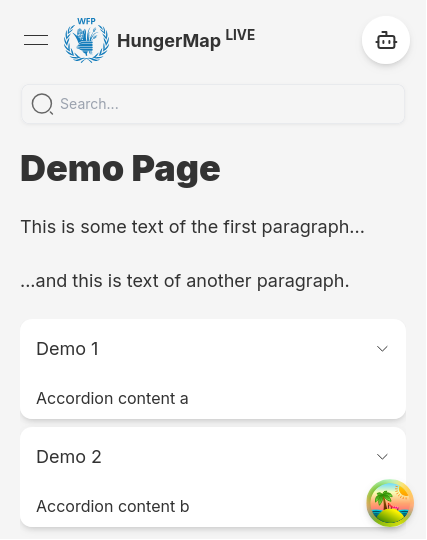

import Tabs from '@theme/Tabs';
import TabItem from '@theme/TabItem';

# How to add a new info page

**Author:** `Jakob Schödl`

> See the [general guide on info pages](/docs/frontend/info_pages) for more general information on the info pages.

## Adding the page itself

1. Create a new subfolder of `src/app` and name it appropriately.
2. Inside of this folder, create a file `layout.tsx`. This file will specify the metadata as well as the general
   appearance of the new page. You may use the code below and adapt it to your needs.
   :::tip
   Make sure to keep the `layout.tsx` file similar to those of other info pages to aim for a consistent user experience.
   :::

    ```tsx title="layout.tsx"
    import { Metadata } from 'next';
    import HungerMapChatbot from '@/components/Chatbot/Chatbot';
    import { Topbar } from '@/components/Topbar/Topbar';
    import { siteConfig } from '@/config/site';
    
    export const metadata: Metadata = {
      // TODO: fill this out to optimize for search engines (see other info pages for examples)
    };
    
    export default function Layout({children}: { children: React.ReactNode }) {
      return (
        <div className="min-h-screen flex flex-col">
          <div className="mb-20">
            <Topbar/>
            <HungerMapChatbot/>
          </div>
          <div className="flex flex-col gap-6 lg:gap-10 p-5 lg:p-10 text-content w-full">{children}</div>
        </div>
      );
    }
    ```

3. Still inside of the newly created folder, add a file `page.tsx`. Add the main content of your new page as below.

:::info
To maintain a clean interface, the content is typically limited to:

* Headings (`h1` and `h2`)
* Text paragraphs
* Accordions with additional details (such as more text, tables, lists or charts)
  :::
   ```tsx title="page.tsx"
      function Page() {
        return (
          <>
            <h1>Demo Page</h1>
            <p>
              Lorem ipsum dolor sit amed.
            </p>
          </>
        );
      }

   export default Page;
   ```

## Adding search

<details>
   <summary>Demo code for a searchable page</summary>

   ```tsx live title="page.tsx" 
    import React, { Suspense, useState } from 'react';

import LiveSuperscript from '@/components/About/LiveSuperscript';
import DocsSearchBar from '@/components/Search/DocsSearchBar';
import DocsSearchBarSkeleton from '@/components/Search/DocsSearchBarSkeleton';
import SearchableSection from '@/components/Search/SearchableSection';
import { AccordionItemProps } from '@/domain/entities/accordions/Accordions';
import { SearchOperations } from '@/operations/Search/SearchOperations';

let demoItems: AccordionItemProps[] = [
  {title: 'Demo 1', content: 'Accordion content a'},
  {title: 'Demo 2', content: 'Accordion content b'},
];
demoItems = SearchOperations.makeAccordionItemsSearchable(demoItems);

let demoTextElements = [
  <p>This is some text of the first paragraph...</p>,
  <p>...and this is text of another paragraph.</p>,
];

demoTextElements = SearchOperations.makeTextElementsSearchable(demoTextElements);

function Page() {
  const [searchWords, setSearchWords] = useState<string[]>([]);
  const [sectionIsVisible, setSectionIsVisible] = useState(true);
  return (
    <>
      <Suspense fallback={<DocsSearchBarSkeleton/>}>
        <DocsSearchBar setSearchWords={setSearchWords}/>
      </Suspense>
      {!searchWords.length && <h1 className="!mb-0">Demo Page</h1>}
      <SearchableSection
        searchWords={searchWords}
        textElements={demoTextElements}
        accordionItems={demoItems}
        onVisibilityChange={setSectionIsVisible}
      />
      {!sectionIsVisible && !!searchWords.length && <p className="text-center">No results</p>}
    </>
  );
}

export default Page;
   ```

The example code should result in a page like this:


</details>

### Providing searchable content

To make page content searchable, store its logical units (e.g. paragraphs or accordion items) into an array. Next,
we need to prepare the array elements for search.
:::note
When searching the page, there are actually two searches ongoing:

* one to filter the content (e.g. the text paragraphs) so that only items with results are visible
    * requirement: search indices (i.e. a `containedWords` field)
    * triggered by a state value (instant)
* one to highlight the search words within the content, for which we make use of an external
  library ([react-highlight-words](https://github.com/bvaughn/react-highlight-words))
    * requirement: all textual content is wrapped with a `RecursiveHighlighter` component
    * triggered by the query param value (debounced)
      :::

:::tip
Store the page contents in separate files within the `domain/constant` folder. This improves not only readability, but
also performance since the content can be prepared for search on the server-side.
:::

<Tabs>
<TabItem value="accordion" label="Accordion items">

```tsx title="src/domain/constant/demo/demoItems.tsx"
import { AccordionItemProps } from '@/domain/entities/accordions/Accordions';
import { SearchOperations } from '@/operations/Search/SearchOperations';

const demoItems: AccordionItemProps[] = [
  {title: 'Demo 1', content: 'a'},
  {title: 'Demo 2', content: 'b'},
];

// highlight-start
// add the containedWords field and wrap each title and content into a RecursiveHighlighter
export default SearchOperations.makeAccordionItemsSearchable(demoItems);
// highlight-end
```

  </TabItem>
<TabItem value="text" label='Paragraphs (or any JSX content)'>

```tsx title="src/domain/constant/demo/demoItems.tsx"
import { SearchOperations } from '@/operations/Search/SearchOperations';

const demoTextElements = [
  <p>This is some text of the first paragraph...</p>,
  <p>...and this is text of another paragraph.</p>,
];

// highlight-start
// add the containedWords field and wrap each paragraph in a RecursiveHighlighter
export default SearchOperations.makeTextElementsSearchable(aboutTextElements);
// highlight-end
```

</TabItem>
<TabItem value="custom" label="Custom">
Implement a function that takes the array of the desired objects and returns a modified version:

1. Add a `containedWords` property for each array item. You may find some examples at
   `operations/Search/SearchOperations.tsx`.

:::note
Each `containedWords` value should be a **string** with the following properties:

* no whitespace except for single spaces
* no upper-case letters
* no duplicate words (optional, but may slightly improve performance and memory usage)
* any order of words

By using this format, calling `containedWords.includes(searchWord)` is sufficient for a search. As the size of the
searched texts is relatively low, no "real" search structure is necessary.
:::

2. Wherever items contains text that will be rendered and should be searchable, it needs to have a
   `RecursiveHighlighter` as parent.

</TabItem>
</Tabs>

### Displaying searchable content using `SearchableSection`

The `SearchableSection` component is a wrapper around three content types, all of which are optional:

* a heading (non-searchable, gets hidden if there are no search results in the rest of the content)
* text paragraphs (given as array of searchable paragraphs)
* an accordion (given as array of searchable items, gets hidden if there are no results within these items)

It ensures that the accordion and text items get filtered during searches and calls the optional function
passed to the `onVisibilityChange` prop with the boolean value of the current visibility (invisible = ongoing search
without results).

:::tip
A common info page would contain multiple `SearchableSection` components. If there are no search results, it is
desirable to show some hint (e.g. "No results") instead of an empty page. The `onVisibilityChange` prop is thus used to
check if there are any visible sections.
:::

### Adding the search bar

Add a [state](https://react.dev/learn/state-a-components-memory) value for the search words and pass the setter function
to the `DocsSearchBar` component. That component will already take care of updating the query params - which
requires a
[Suspense boundary](https://nextjs.org/docs/app/building-your-application/routing/loading-ui-and-streaming#example)
around it.

```tsx title="page.tsx"
import React, { Suspense, useState } from 'react';

import DocsSearchBar from '@/components/Search/DocsSearchBar';
import DocsSearchBarSkeleton from '@/components/Search/DocsSearchBarSkeleton';

function Page() {
  // ...
  // highlight-next-line
  const [searchWords, setSearchWords] = useState<string[]>([]);
  return (
    <>
      // highlight-start
      <Suspense fallback={<DocsSearchBarSkeleton/>}>
        <DocsSearchBar setSearchWords={setSearchWords}/>
      </Suspense>
      // highlight-end
      {/* ... (you may use searchWords here) */}
    </>
  );
}
```
