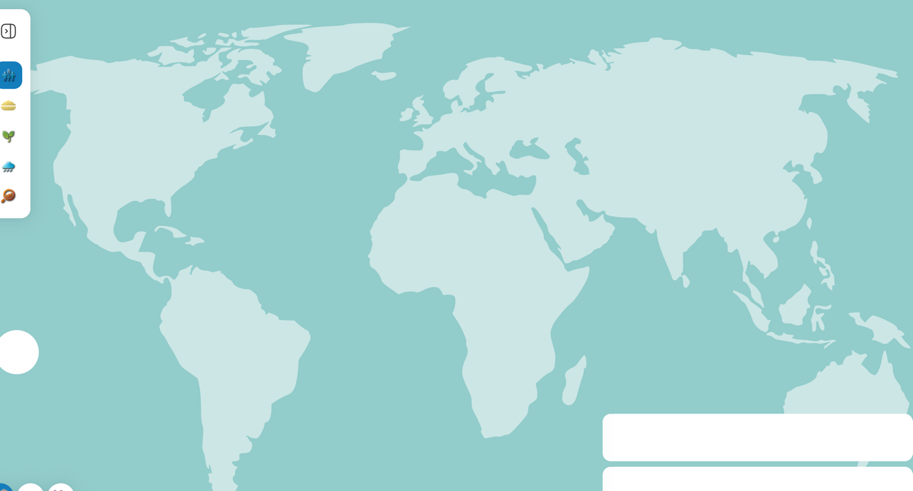
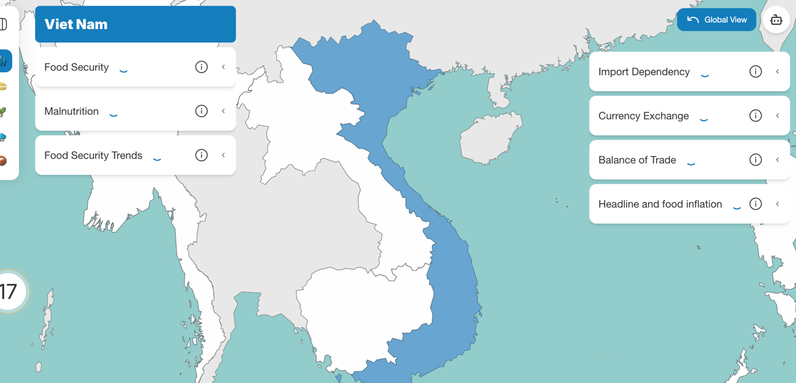

# Loading and Skeletons
Author: ```Lukas Weigmann```

## Overview
When the application is loading data, the corresponding components are showing a skeleton or loading animation.
Here we will go over the most important loading functionality regarding the map.

## Loading of application
When the map is loading the initial data containing information about the shapes of the countries and their borders, a skeleton
shaped like a world map is shown. Instead of the zoom control element also a skeleton is shown:

In ```src/components/Map/MapLoader.tsx``` you can find the code for showing the skeleton component while loading the application and
once this is done the [Map Component](map_component) is shown.

The skeleton for the map is based on a SVG that is used in ```src/components/Map/MapSkeleton.tsx```. Here both of the skeletons can be customized:
```ts
export default function MapSkeleton() {
  return (
    <div className="z-1 h-full w-full">
      <MapSkeletonData className="h-full w-full animate-opacityPulse fill-countriesBase bg-ocean" />
      <ZoomControlSkeleton />
    </div>
  );
}
```
The SVG is added additional behavior by using tailwind classes. animate-opacityPulse for example adds the behavior for changing
the opacity of the element continuously and is defined in the tailwind config file.  

## Loading after selection of country
When a country is selected, the map zooms to the corresponding country and is showing a skeleton in the shape of the country and
a loading animation for the accordions.

The code for this behavior can be found in the [Cloropleth Component](cloropleths) of the currently selected mode in the
CountryLoadingLayer component: 
```ts
function CountryLoadingLayer({ data, selectedCountryId, color }: CountryLoadingProps) {
  const filteredFeatures = data.features.filter((feature) => feature?.properties?.adm0_id === selectedCountryId);

  return (
    <GeoJSON
      data={{ type: 'FeatureCollection', features: filteredFeatures } as FeatureCollection<Geometry, GeoJsonProperties>}
      style={{
        color: 'undefined',
        fillOpacity: 0.3,
        fillColor: color,
        className: 'animate-opacityPulse',
      }}
    />
  );
}
```
Simply the data that is already passed to the cloropleth in order to be displayed in the global view is passed down to this component
and shown with a different styling and behavior. Here the skeleton can again be customized (e.g. opacity, color etc.).
