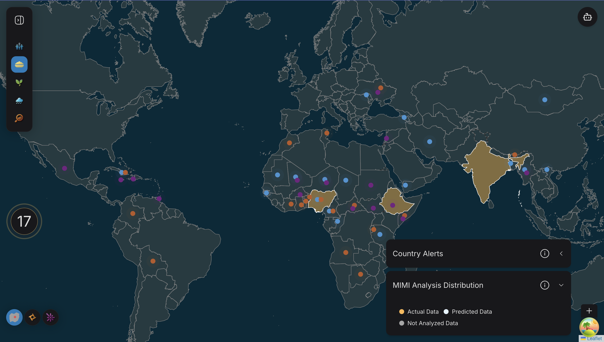
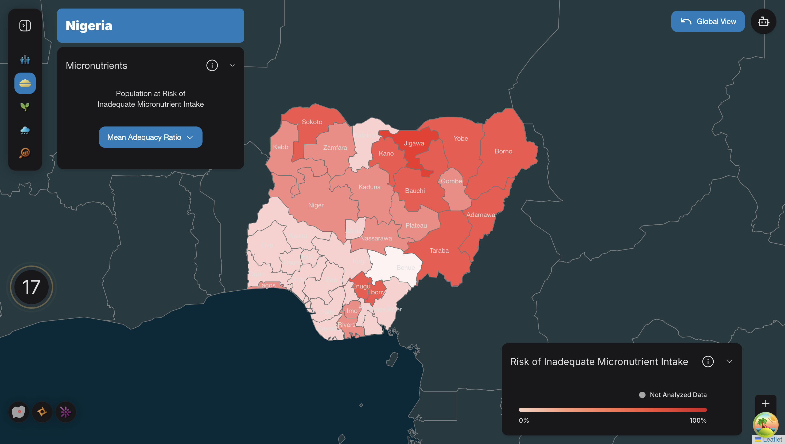
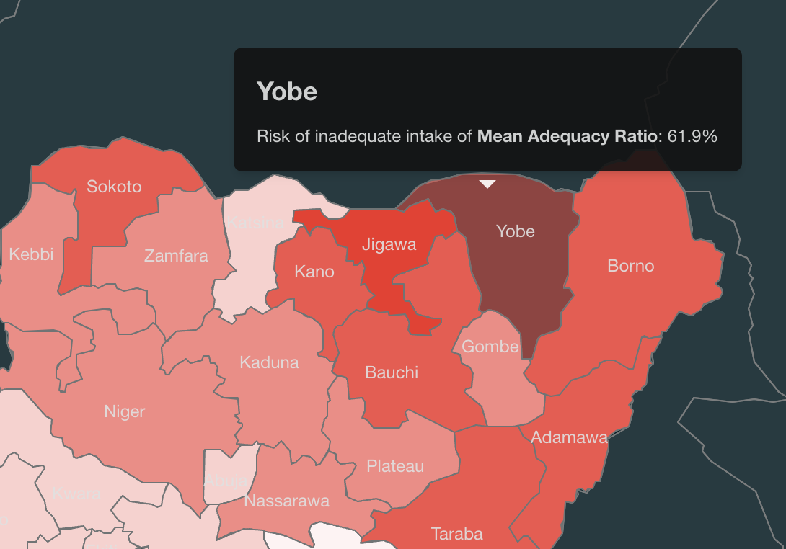

### Nutrition Layer

Nutrition layer of the hunger map gives the information of Nutrition in the world as well as country level. The implementation leverages Leaflet and react-leaflet for map rendering and interactivity, GeoJSON for representing geographical data, and integrates with custom React components and hooks like ```useSelectedCountryId``` and ```useNutritionQuery``` for managing state and fetching nutrition data dynamically.

---

#### World View 

The nutrition value of world view is fetched using the hook useNutritionQuery. The hook is a custom wrapper around React Query's useQuery for fetching and caching nutritional data. It accepts an enabled boolean parameter to control whether the query is active. The endpoint ```globalRepo.getNutritionData``` is used for fetching the global level nutrition data.
```js 
export const useNutritionQuery = (enabled: boolean) =>
  useQuery<CountryNutrition>(
    {
      queryKey: ['fetchNutritionData'],
      queryFn: globalRepo.getNutritionData,
      enabled,
    },
    cachedQueryClient
  );
``` 

```js
{selectedMapType === GlobalInsight.NUTRITION &&
    countries.features.map((country) => (
         <NutritionChoropleth
            key={country.properties.adm0_id}
            countryId={country.properties.adm0_id}
            data={{ type: 'FeatureCollection', features: [country as Feature<Geometry, GeoJsonProperties>] }}
            regionNutritionData={regionNutritionData}
            selectedCountryName={selectedCountryName}
            regionLabelData={regionLabelData}
            setRegionLabelTooltips={setRegionLabelTooltips}
          />
        ))}
```

This code creates a global view of nutrition data by rendering the NutritionChoropleth for every country. It enables visualization of nutrition information at global level. Along with nutrition information, the legends will also appear, giving the important information regrading the colors which have set for the world view of nutrition.

In ``` NutritionChoropleth.tsx ``` the NutritionChoropleth function renders a nutrition-focused interactive choropleth map using react-leaflet and GeoJSON data. It dynamically displays country or pass region-level features to ```NutritionStateChoropleth``` if the user selects the country, applying custom styles based on nutrition data. It also incorporates interactive tooltips that display country names when hovering over map layers, with tooltips being disabled for selected countries or when data is unavailable. Additionally, it supports interactivity, allowing users to click on countries, updating the selected country state and dynamically rendering either a detailed regional map with micronutrients value of each region or a loading state while data is being fetched. Main props need by NutritionChoropleth are : 

- ```data```:	GeoJSON data for rendering the map layers.
- ```countryId```: ID of the country represented by this instance of the component.
- ```regionNutritionData```: Nutrition data for regions (if available).
- ```selectedCountryName```: Name of the currently selected country.
- ```regionLabelData```: Label data for regions within the country.
- ```setRegionLabelTooltips```: Callback to manage tooltips for regional labels.



---

#### Country View

The NutritionStateChoropleth component provides an interactive map visualization for region-level nutrition data within a selected country. Country level nutrition data get extracted with the help of this endpoint ```countryRepository.getRegionNutritionData(selectedCountryData.properties.adm0_id)```. It uses react-leaflet's GeoJSON component to render map layers dynamically styled and updated based on the user's selected nutrient type. Tooltips and hover effects enrich interactivity, while the NutritionAccordion enables users to select different nutrients, driving visual and informational updates across the map. Per default it will show the region map of ***Mean Adequacy Ratio***. User can select from 7 different micronutrients. These are Folate, Iron, Zinc, Vitamin A and Vitamin B12.
NutritionStateChoropleth component get rendered with the following props: 

- ```regionNutrition```: Nutrition data for the states or regions.
- ```countryName```: The name of the selected country for display.
- ```regionLabelData```: Data used for labeling regions.
- ```setRegionLabelTooltips```: A callback for managing tooltips for regional labels.
- ```countryMapData```: GeoJSON data specific to the selected country's map.


``` js
regionNutritionData && countryId === selectedCountryId && regionLabelData && (
<NutritionStateChoropleth
    regionNutrition={regionNutritionData}
    countryName={selectedCountryName}
    regionLabelData={regionLabelData}
    setRegionLabelTooltips={setRegionLabelTooltips}
    countryMapData={data.features[0] as CountryMapData}
/>
)
```



**Other Features**

In the country view of the nutrition, user experience hover effect when move mouse over region. When hover over the region, the tooltip appear with content name of the region, current selected micronutrient and the value of the micronutrient.




