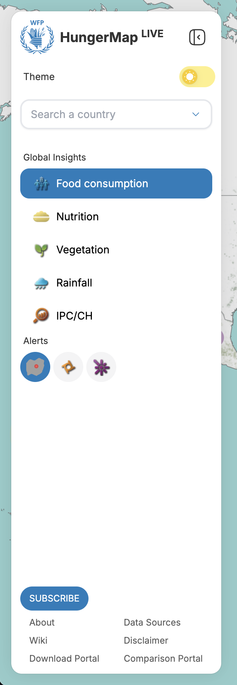
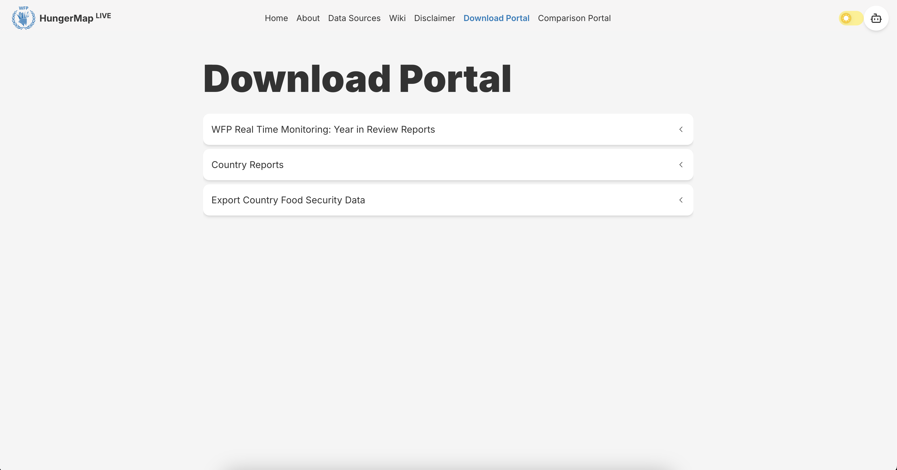
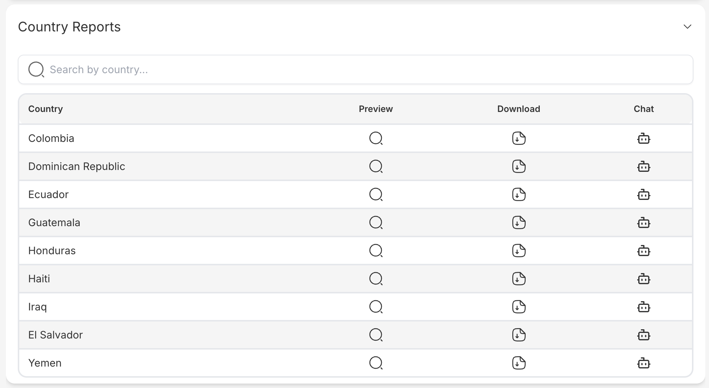
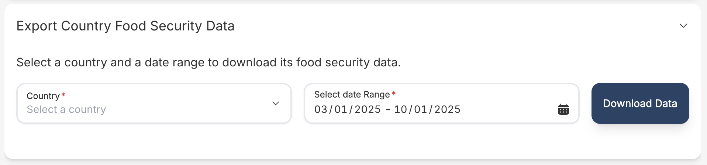
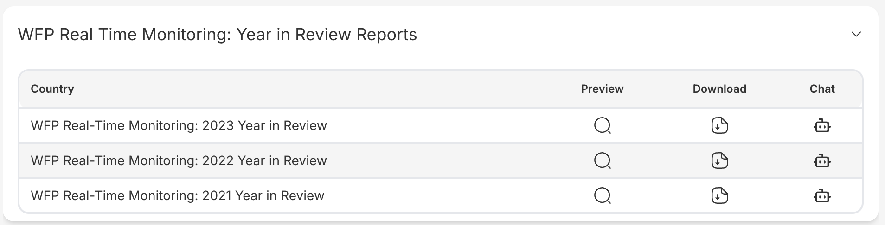

## Key features

This document provides an overview of the Download Page in the frontend of the WFP HungerMap project. The Download Page allows users to access and download various data and reports.

### Navigation Bar
- **Description**: The navigation bar provides links to different sections of the application, allowing users to easily navigate through the site. It includes links to the Home page, Country Data, FCS Data, Main Download Page, and Yearly Reports. The navigation bar is designed to be intuitive and accessible, ensuring that users can quickly find the information they need.

### Main Download Page
- **Description**: The main download page aggregates all available data and reports. Users can browse through different categories such as country reports, regional analyses, and thematic studies. Each category contains downloadable files in various formats (e.g., PDF, Excel). The main download page is designed to be a one-stop-shop for all data and reports, making it easy for users to find and download the information they need.

### Country Data
- **Description**: This section displays data specific to different countries. Users can select a country from a dropdown menu or a map interface to have preview of detailed information and download relevant data. The data includes various indicators such as food security levels, economic conditions, and demographic information. Besides users can also trigger here a chatbot directly to utlize our AI tool to help him use our website smoothly. This section is essential for users who need country-specific insights and data for analysis or reporting purposes.

### Food Consumption Score (FCS) Data
- **Description**: The FCS data section provides information on the Food Consumption Score, which is a key indicator used to assess food security. Users can download FCS data for various regions, which includes metrics on dietary diversity and food frequency. This data is crucial for understanding the nutritional status of populations and making informed decisions on food security interventions.

### Yearly Report
- **Description**: This section offers access to yearly reports. Users can download comprehensive reports that provide insights and analysis on food security trends over the past years. The reports include detailed assessments, statistical analyses, and recommendations for policy and program interventions. This section is valuable for researchers, policymakers, and practitioners who need historical data and trend analysis to inform their work.

