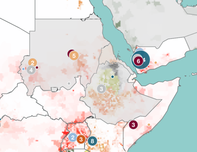

# Alerts

## Overview
Alerts are the markers that are placed inside of the map indicating certain events such as different types of conflicts for
the conflict alerts. The different alert types are implemented in src/components/Map/Alerts/AlertContainer.tsx that is placed
as a leaflet layer in the [Map Component](map_component.md). You can read more about [how to add a new alert](../how_to/how_to_add_alert).

## Structure
The wrapper components for each alert type are placed in the AlertContainer file mentioned above:
```ts
export const AlertContainer = React.memo(({ countries, alertData }: AlertContainerProps) => {
  const { selectedAlert } = useSelectedAlert();

  switch (selectedAlert) {
    case AlertType.CONFLICTS:
      return <ConflictLayer />;
    case AlertType.HAZARDS:
      return <HazardLayer />;
    case AlertType.COUNTRY_ALERTS:
      return <CountryAlertsLayer countries={countries} alerts={alertData} />;
    default:
      return null;
  }
});
```
Thus the functionality for each type is implemented in its layer component. The data for country alerts are passed down
from the parent element, conflict layer and hazard layer use hooks for fetching the data.
The structure for the different types is quite similar. That's why we will take the conflict layer as an example:

```ts
export function ConflictLayer() {
  const { data, isPending } = useConflictQuery(true);
  const conflictsByType = useMemo(() => ConflictOperations.sortConflictsByType(data), [data]);

  return (
    <div>
      {!isPending &&
        data &&
        (Object.keys(conflictsByType) as ConflictType[]).map((conflictType) => (
          <MarkerClusterGroup
            key={conflictType}
            iconCreateFunction={(cluster) => ConflictOperations.createClusterCustomIcon(cluster, conflictType)}
            showCoverageOnHover={false}
            spiderLegPolylineOptions={{ weight: 0 }}
            disableClusteringAtZoom={MAP_MAX_ZOOM}
            zoomToBoundsOnClick={false}
            maxClusterRadius={60}
            spiderfyOnMaxZoom={false}
          >
            {conflictsByType[conflictType].map((marker) => (
              <CircleMarker
                radius={3}
                color="white"
                fillColor={getTailwindColor(`--nextui-${ConflictOperations.getMarkerColor(conflictType)}`)}
                weight={1}
                fillOpacity={1}
                key={marker.geometry.coordinates.toString()}
                center={GeometryOperations.swapCoords(marker.geometry.coordinates)}
              />
            ))}
          </MarkerClusterGroup>
        ))}
    </div>
  );
}
```
All markers are collected in a MarkerClusterGroup wrapper component from the [react-leaflet-cluster](https://akursat.gitbook.io/marker-cluster) library.
This library clusters multiple alerts close to each other to one marker and shows them with a number of how many markers
are simplified by the cluster.\
 \
In this component markers are mapped to the alert data. Here you can also further customize the [cluster behavior](https://akursat.gitbook.io/marker-cluster/api)
or [the markers](https://leafletjs.com/reference.html#marker) itself.
